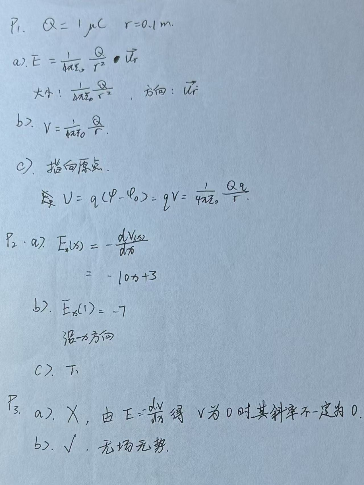

# Week 1 Day 2 Exercises

## Exercise 4: Electric fields and potential — practice

### Question 1: Point charge

A point charge $Q = +1\;\mu\text{C}$ is placed at the origin.

At $r = 0.1\;\text{m}$:

1. find the magnitude and direction of $\mathbf{E}$;
2. find $V$ (taking $V=0$ at infinity);
3. if an electron is placed at $r = 0.1\;\text{m}$, what is the direction of the electric force on it, and what is its potential energy in eV?

### Question 2: Differential relation

The electric potential in a region is

$$
V(x) = 5x^2 - 3x + 2\;\text{V}.
$$

1. Find $E_x(x)$.
2. What is the direction of $\mathbf{E}$ at $x = 1\;\text{m}$?
3. At $x = 1\;\text{m}$, is $V$ increasing or decreasing in the $+x$ direction?

### Question 3: Conceptual

True or false? Justify your answer briefly.

1. "Where $V=0$, $\mathbf{E}$ must be $0$."
2. "Where $\mathbf{E}=0$, $V$ must be $0$."

## Electric-fields-practice answer

