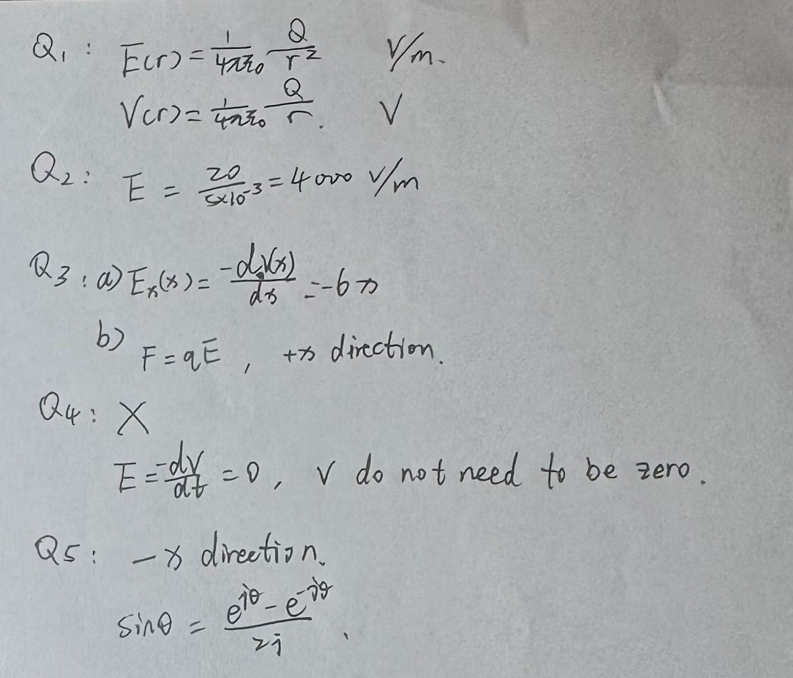

# Week 1 Day 2 Exercises

## Exercise 5: Exit Test

### Question 1: Point-charge formulas

Write the formulas for $\mathbf{E}(r)$ and $V(r)$ due to a point charge $Q$, and state the SI units of $\mathbf{E}$ and $V$.

### Question 2: Parallel-plate capacitor

A parallel-plate capacitor has plate separation $d = 5~\text{mm}$ and a potential difference $V_0 = 20~\text{V}$ between the plates.

1. Find $|\mathbf{E}|$ in V/m.
2. State the direction of $\mathbf{E}$ relative to the plates.

### Question 3: Field from potential

The electric potential is

$$
V(x) = 3x^2~\text{V}.
$$

1. Find $E_x(x)$.
2. An electron is placed at $x = 2~\text{m}$. What is the direction of the electric force on it?

### Question 4: Conductor in equilibrium

True or false? Justify your answer.

"Inside a conductor in electrostatic equilibrium $\mathbf{E}=0$, so $V$ must be zero."

### Question 5: Day-1 recall

1. What is the propagation direction of a wave described by $e^{j(\omega t + \beta x)}$?
2. Write the complex-exponential identity for $\sin\theta$, making sure the denominator is correct.

## Electric-fields exit-test answer

