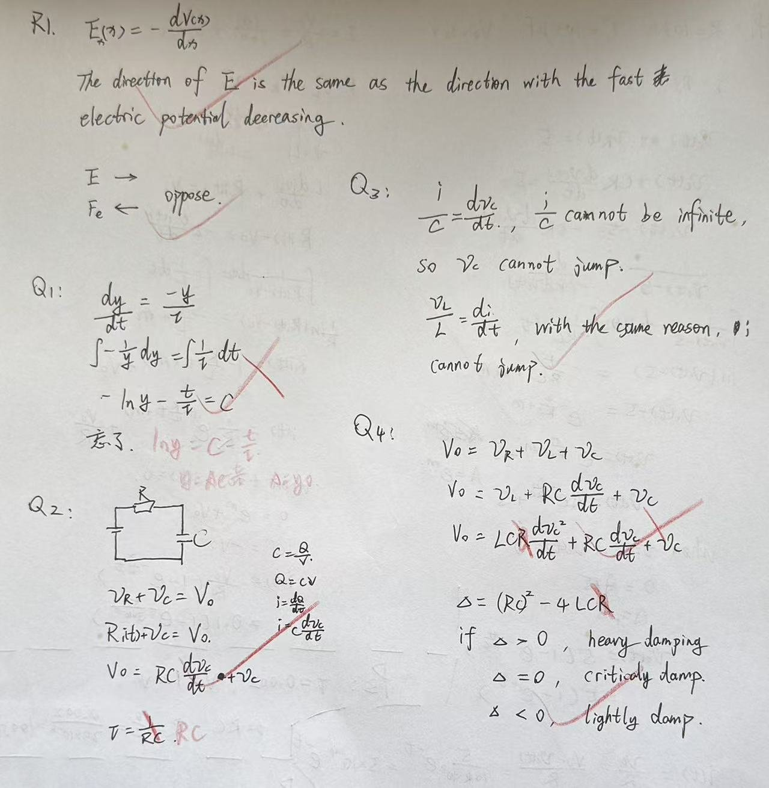

# Exercise 06 - Circuit ODE entry diagnostic

- Week 1, Day 3 | Type: entry diagnostic (closed-book, handwritten) | Date: 2026-07-29
- Companion notes: [day03-dynamic-systems-circuit-odes.md](../../notes/week01/day03-dynamic-systems-circuit-odes.md)
- Result: modelling correct; two gaps identified (both closed later in the session)

## Questions

**R1.** (Day-2 warm-up) In one dimension, how is the electric field related to the
potential, and what does the minus sign mean? Which way does an electron feel pushed
relative to $\mathbf{E}$?

**Q1.** Solve $\frac{dy}{dt} = -\frac{y}{\tau}$ with $y(0) = y_0$ ($\tau > 0$ constant).

**Q2.** A resistor $R$ and capacitor $C$ in series are connected to a DC voltage step
(at $t = 0$ the source jumps from $0$ to $V_0$). Write the differential equation for
the capacitor voltage $v_C(t)$ and give its time constant.

**Q3.** Can the capacitor voltage change instantaneously? Can the inductor current
change instantaneously? Why? (Use $i_C = C\,\frac{dv_C}{dt}$ and
$v_L = L\,\frac{di_L}{dt}$.)

**Q4.** For a series RLC circuit, write the general form of its characteristic
equation; what determines whether the response oscillates?

## Key results / marking

- **R1: correct.** $E_x = -\frac{dV}{dx}$; $\mathbf{E}$ points along the direction of
  steepest potential decrease; the electron feels a force opposite to $\mathbf{E}$.
  (Day-2 review item resolved.)
- **Q1: method correct, execution incomplete.** Separation of variables was done
  correctly up to $-\ln y - \frac{t}{\tau} = C$, but the solution stopped before the
  three finishing steps: exponentiate, rename the constant ($A = e^{-C}$), apply the
  initial condition. Target answer: $y = y_0 e^{-t/\tau}$. This gap was closed in the
  practice session (exercise 07, P1 and P2 both contain full derivations).
- **Q2: ODE correct, $\tau$ wrong initially.** KVL chain
  $V_0 = Ri + v_C = RC\frac{dv_C}{dt} + v_C$ was fully correct. The time constant was
  first stated as $\frac{1}{RC}$; correction: the coefficient of $v_C$ in standard
  form is $\frac{1}{\tau}$, hence $\tau = RC$. Unit check: $[RC]$ is s, $[1/(RC)]$
  is a frequency.
- **Q3: correct.** Finite $i$ gives finite $\frac{dv_C}{dt}$, so $v_C$ is continuous;
  same argument for $i_L$ via $v_L = L\frac{di}{dt}$.
- **Q4: structure correct, two slips.** The KVL substitution chain was right, but an
  extra factor $R$ entered the second-derivative term when $v_L = L\frac{di}{dt}$ was
  assembled (correct leading coefficient: $LC$, giving
  $LC\frac{d^2v_C}{dt^2} + RC\frac{dv_C}{dt} + v_C = V_0$), and the second derivative
  was written as $\frac{dv_C^2}{dt}$ instead of $\frac{d^2v_C}{dt^2}$ (notation issue,
  recurred in exercise 08 ET4; added to the review queue). The discriminant
  classification logic and its three cases were correct; standard names are
  over-damped ($\Delta > 0$), critically damped ($\Delta = 0$), under-damped
  ($\Delta < 0$, oscillatory).

## Handwritten answers

