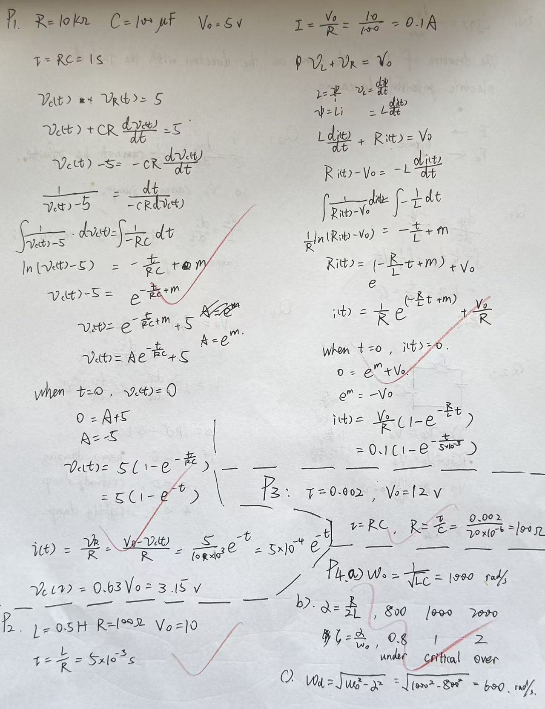

# Exercise 07 - Circuit ODE practice

- Week 1, Day 3 | Type: mid-session practice, about 20 min (closed-book, handwritten) | Date: 2026-07-29
- Companion notes: [day03-dynamic-systems-circuit-odes.md](../../notes/week01/day03-dynamic-systems-circuit-odes.md)
- Result: 4/4 correct on first attempt

## Questions

**P1.** Series RC: $R = 10$ k$\Omega$, $C = 100$ $\mu$F, step amplitude $V_0 = 5$ V
applied at $t = 0$ to an initially uncharged capacitor.
(a) Find the time constant $\tau$ (show the unit conversion).
(b) Write $v_C(t)$.
(c) Find $i(0^+)$.
(d) Evaluate $v_C(\tau)$ numerically.

**P2.** Series RL: $L = 0.5$ H, $R = 100$ $\Omega$, 10 V step, zero initial current.
Find $\tau$, the steady-state current, and $i(t)$.

**P3.** The measured response of an RC circuit is, in SI units,

$$
v_C(t) = 12\left(1 - e^{-t/0.002}\right)
$$

Read off $\tau$ and the steady-state voltage; if $C = 20$ $\mu$F, find $R$.

**P4.** Series RLC: $L = 10$ mH, $C = 100$ $\mu$F.
(a) Find $\omega_0$.
(b) For $R = 16$ $\Omega$, $R = 20$ $\Omega$ and $R = 40$ $\Omega$, find $\alpha$ and $\zeta$
and classify the response (over- / critically / under-damped).
(c) For the under-damped case, find $\omega_d$.

## Key results (answer key)

- P1: $\tau = RC = 1$ s; $v_C(t) = 5\left(1 - e^{-t}\right)$ V; $i(0^+) = V_0/R = 0.5$ mA
  (the current jumps while $v_C$ stays continuous); $v_C(\tau) \approx 3.16$ V.
- P2: $\tau = L/R = 5$ ms; $i(\infty) = V_0/R = 0.1$ A; $i(t) = 0.1\left(1 - e^{-200t}\right)$ A.
- P3: $\tau = 2$ ms; steady state 12 V; $R = \tau/C = 100$ $\Omega$.
- P4: $\omega_0 = 1000$ rad/s. $R = 16$ $\Omega$: $\alpha = 800$ s$^{-1}$, $\zeta = 0.8$,
  under-damped, $\omega_d = 600$ rad/s. $R = 20$ $\Omega$: $\alpha = 1000$ s$^{-1}$,
  $\zeta = 1$, critically damped. $R = 40$ $\Omega$: $\alpha = 2000$ s$^{-1}$, $\zeta = 2$,
  over-damped.

## Handwritten solutions

## Feedback notes

- All four solutions were correct, including two complete separation-of-variables
  derivations (exponentiate, rename the constant, apply the initial condition); this
  closed the gap identified in the entry diagnostic (exercise 06, Q1).
- Minor habits to keep: write "$10$ k$\Omega$" or "$10 \times 10^3$ $\Omega$"
  (never both factors at once), and append units to final answers such as currents.
- The derivation in P2 used $\ln|Ri - V_0|$ with the absolute value; keep this.
