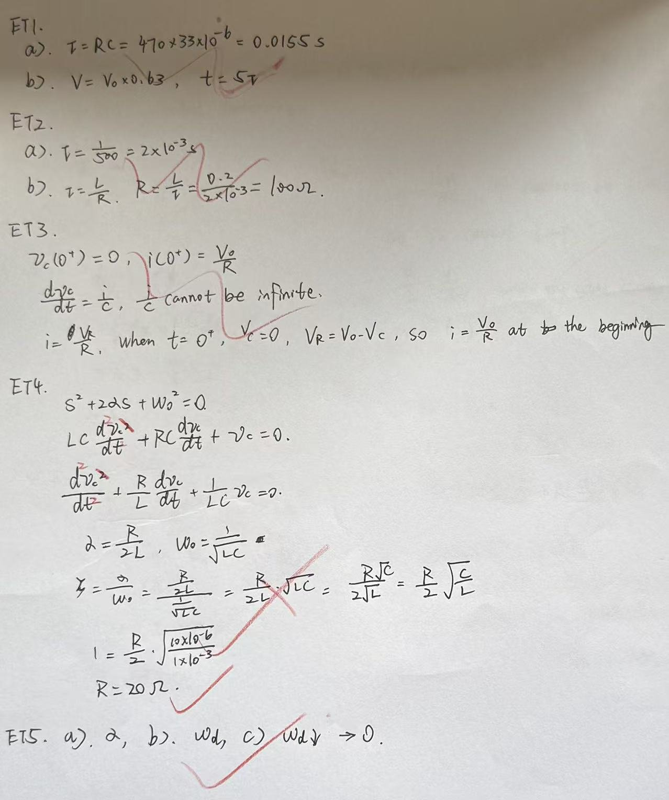

# Exercise 08 - Circuit ODE exit test

- Week 1, Day 3 | Type: closed-book exit test (handwritten) | Date: 2026-07-29
- Companion notes: [day03-dynamic-systems-circuit-odes.md](../../notes/week01/day03-dynamic-systems-circuit-odes.md)
- Result: 5/5 correct; mastery estimate about 95%

## Questions

**ET1.** RC circuit: $R = 470$ $\Omega$, $C = 33$ $\mu$F, step amplitude $V_0$.
(a) Find $\tau$, showing the unit conversion.
(b) What percentage of $V_0$ is reached at $t = \tau$?
(c) After roughly how long is the capacitor essentially full (>99%)?

**ET2.** The current of an RL circuit after the source is removed is
$i(t) = 0.02 e^{-500t}$ A.
(a) Read off $\tau$.
(b) If $L = 0.2$ H, find $R$.

**ET3.** In an RC charging circuit at $t = 0^+$: give $v_C(0^+)$ and $i(0^+)$, and in
one or two sentences each explain why $v_C$ cannot jump while $i$ can.

**ET4.** Series RLC with $L = 1$ mH, $C = 10$ $\mu$F: find the $R$ that gives
critical damping (from the discriminant or from $\zeta = 1$; show the derivation).

**ET5.** In the under-damped solution

$$
v_C(t) = V_0 + e^{-\alpha t}\left(A\cos(\omega_d t) + B\sin(\omega_d t)\right)
$$

(a) which parameter controls the envelope decay?
(b) which parameter sets the ringing frequency?
(c) as $R$ increases from 0 toward the critical value, how does $\omega_d$ change,
and what is its limiting value?

## Key results (answer key)

- ET1: $\tau = RC \approx 15.5$ ms; 63.2%; $5\tau \approx 77.6$ ms.
- ET2: $\tau = 1/500 = 2$ ms; $R = L/\tau = 100$ $\Omega$.
- ET3: $v_C(0^+) = 0$ because finite $i$ gives finite $dv_C/dt$ (continuity of the
  state); $i(0^+) = V_0/R$ because at $t = 0^+$ the resistor sees the full
  $V_0 - v_C = V_0$. Derivatives may jump; the state cannot.
- ET4: $\zeta = \frac{R}{2}\sqrt{C/L} = 1 \Rightarrow R = 2\sqrt{L/C} = 20$ $\Omega$.
- ET5: $\alpha$; $\omega_d$; since $\alpha = R/(2L)$ grows with $R$, the value
  $\omega_d = \sqrt{\omega_0^2 - \alpha^2}$ decreases and vanishes at the critical point.

## Marking summary

All five answers were correct, including the design-style derivation in ET4
($R = 2\sqrt{L/C}$). One recurring notation issue was flagged to the review queue:
the second derivative must be written $\frac{d^2v_C}{dt^2}$; the form
$\frac{dv_C^2}{dt}$ instead means the derivative of $v_C^2$.

## Handwritten answers

