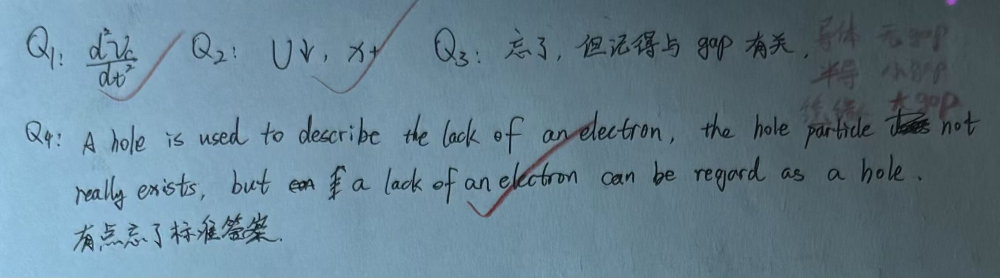

# Exercise 09 - Semiconductor foundations entry diagnostic

- Week 1, Day 4 | Type: closed-book entry diagnostic (handwritten) | Date: 2026-07-30
- Companion notes: [day04-semiconductor-photonics-foundations.md](../notes/week01/day04-semiconductor-photonics-foundations.md)
- Result: 4/4 correct; mastery estimate about 100%

## Questions

**Q1.** Write the second derivative of $v_C$ with respect to time correctly.

**Q2.** If $V(x)$ increases with $x$, which way does an electron's potential energy $U = -eV$ change, and which way is the electron pushed?

**Q3.** What is the fundamental difference between a conductor, semiconductor, and insulator in terms of band structure?

**Q4.** What is a "hole" in semiconductor physics?

## Key results (answer key)

- Q1: $\frac{d^2 v_C}{dt^2}$
- Q2: $U$ decreases; electron pushed toward higher $V$
- Q3: Conductor: overlapping bands; Semiconductor: small $E_g$; Insulator: large $E_g$
- Q4: Missing electron in valence band, behaves like positive charge

## Handwritten answers

