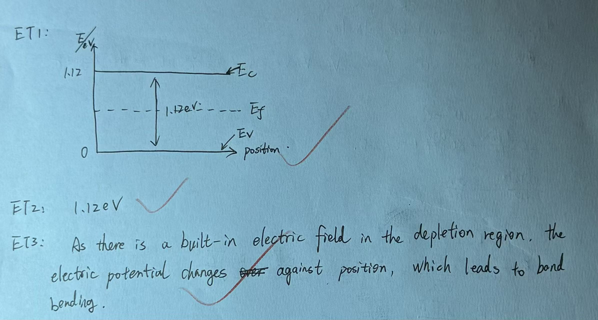

# Exercise 10 - Semiconductor foundations exit test

- Week 1, Day 4 | Type: closed-book exit test (handwritten) | Date: 2026-07-30
- Companion notes: [day04-semiconductor-photonics-foundations.md](../notes/week01/day04-semiconductor-photonics-foundations.md)
- Result: 3/3 correct; mastery estimate about 100%

## Questions

**ET1.** Draw a simple band diagram for intrinsic silicon. Label $E_V$, $E_C$, and $E_g$.

**ET2.** If the band gap of silicon is 1.12 eV, what is the minimum photon energy required for absorption?

**ET3.** In a PN junction, why do the bands bend in the depletion region? Explain in one sentence.

## Key results (answer key)

- ET1: $E_V$ (valence band max), $E_C$ (conduction band min), $E_g = E_C - E_V = 1.12\,\text{eV}$
- ET2: $E_{photon} \geq E_g = 1.12\,\text{eV}$
- ET3: Built-in electric field in depletion region causes potential variation, leading to band bending

## Handwritten answers

