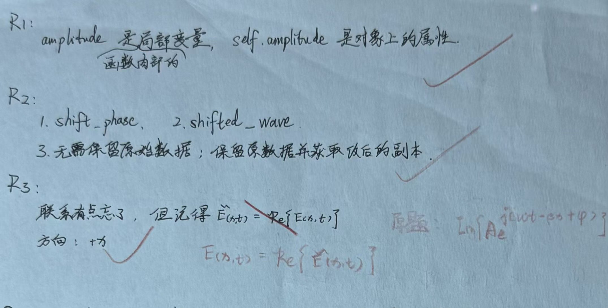

# Exercise 14 - Vector Calculus Entry Diagnostic

- Week 2, Day 1 | Type: entry diagnostic (closed-book, handwritten) | Date: 2026-08-07
- Companion notes: [day01-vector-calculus-foundations.md](../../notes/week02/day01-vector-calculus-foundations.md)
- Result: OOP recall mostly secure; complex-exponential link partly recalled

## Questions

**R1.** In a Python class method, what does `self` represent? Why is `self.amplitude` used instead of only `amplitude`?

**R2.** Compare a method that modifies `self.phase` with a method that returns a new shifted `Wave` object. Which changes the original object, which creates a new object, and when is each design appropriate?

**R3.** Explain the relationship between $A\sin(\omega t-\beta x+\phi)$ and the complex exponential $Ae^{j(\omega t-\beta x+\phi)}$. Determine the propagation direction.

## Key Results

- `self` is the current instance. A constructor parameter such as `amplitude` is local to the call, while `self.amplitude` is stored on the object.
- Directly updating `self.phase` mutates the original object. Returning a new `Wave` preserves the original and creates a shifted copy.
- The cosine is the real part and the sine is the imaginary part of the corresponding complex exponential. Equivalently, sine may be represented as the real part after a phase shift of $-\pi/2$.
- The phase $\omega t-\beta x+\phi$ describes propagation in the positive $x$ direction.

## Feedback Summary

- R1: basically correct; `self` needed to be identified explicitly as the current object
- R2: correct
- R3: propagation direction correct; the real-part versus imaginary-part connection needed completion

## Handwritten Answer

