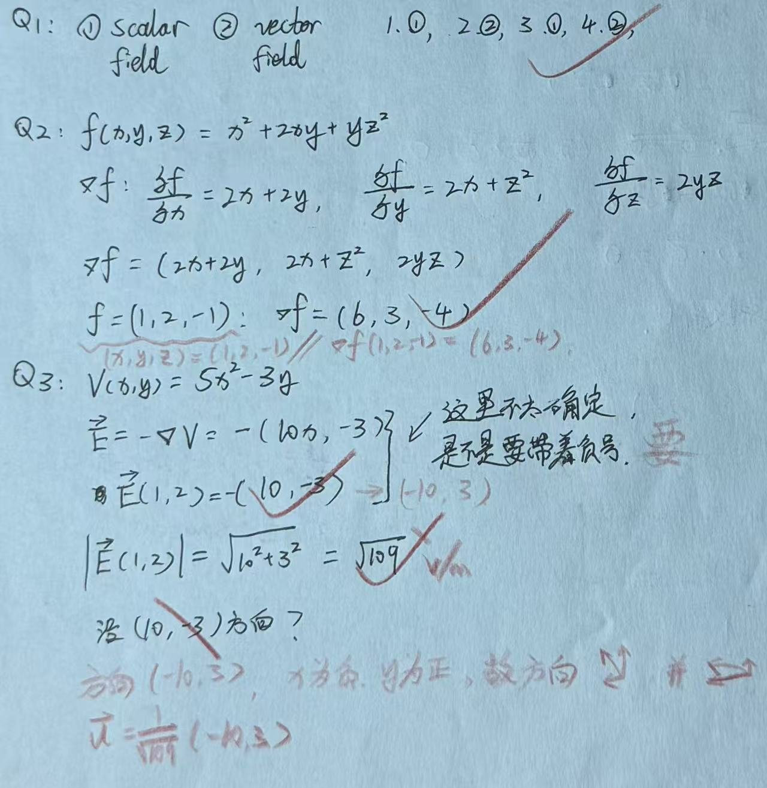

# Exercise 15 - Gradient Practice

- Week 2, Day 1 | Type: practice (closed-book, handwritten) | Date: 2026-08-07
- Companion notes: [day01-vector-calculus-foundations.md](../../notes/week02/day01-vector-calculus-foundations.md)
- Result: all calculations correct; vector direction notation refined

## Questions

**Q1.** Classify electric potential $V$, electric field $\vec{E}$, temperature $T$ and current density $\vec{J}$ as scalar or vector fields.

**Q2.** Given $f(x,y,z)=x^2+2xy+yz^2$, find $\nabla f$ and evaluate $\nabla f(1,2,-1)$.

**Q3.** Given $V(x,y)=5x^2-3y$, find $\vec{E}=-\nabla V$. Evaluate the field at $(1,2)$ and give its components, magnitude and direction.

## Key Results

- $V$ and $T$ are scalar fields; $\vec{E}$ and $\vec{J}$ are vector fields.
- $\nabla f=(2x+2y,2x+z^2,2yz)$ and $\nabla f(1,2,-1)=(6,3,-4)$.
- $\vec{E}(x,y)=(-10x,3)$, so $\vec{E}(1,2)=(-10,3)$ and $|\vec{E}|=\sqrt{109}$.
- The field points mainly in the negative $x$ direction and slightly in the positive $y$ direction.

## Feedback Summary

- Q1: correct
- Q2: correct; write the evaluation point as $(x,y,z)=(1,2,-1)$ rather than assigning the point to $f$
- Q3: calculation correct; expand the leading minus sign fully and report magnitude, direction and units

## Handwritten Answer

