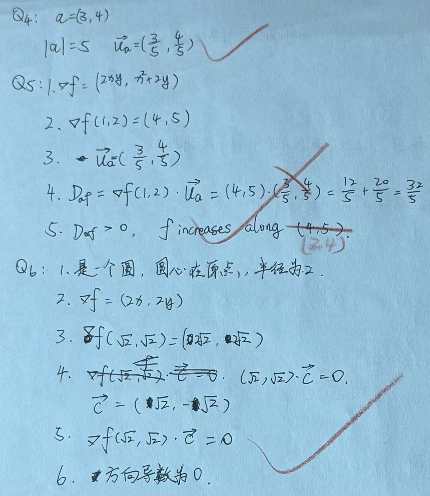

# Exercise 16 - Directional Derivative and Level Curves Practice

- Week 2, Day 1 | Type: practice (closed-book, handwritten) | Date: 2026-08-07
- Companion notes: [day01-vector-calculus-foundations.md](../../notes/week02/day01-vector-calculus-foundations.md)
- Result: calculations correct; specified direction and gradient direction distinguished

## Questions

**Q4.** Given $\vec{a}=(3,4)$, find its magnitude and the corresponding unit direction vector.

**Q5.** Given $f(x,y)=x^2y+y^2$, find $\nabla f$, evaluate it at $(1,2)$ and find the directional derivative along $\vec{a}=(3,4)$. State whether $f$ increases or decreases.

**Q6.** Given $f(x,y)=x^2+y^2$, describe the level curve $f=4$. Find the gradient at $(\sqrt{2},\sqrt{2})$, give one tangent vector and verify that the gradient is perpendicular to the level curve.

## Key Results

- $|\vec{a}|=5$ and $\vec{u}=(3/5,4/5)$.
- $\nabla f=(2xy,x^2+2y)$, $\nabla f(1,2)=(4,5)$ and $D_{\vec{u}}f=32/5>0$.
- The function increases along the specified direction $(3,4)$. The gradient direction $(4,5)$ is the direction of maximum increase.
- The level curve $x^2+y^2=4$ is a circle of radius 2. At $(\sqrt{2},\sqrt{2})$, $\nabla f=(2\sqrt{2},2\sqrt{2})$.
- A tangent vector is $(\sqrt{2},-\sqrt{2})$, and its dot product with the gradient is zero.

## Feedback Summary

- Q4: correct
- Q5: calculation correct; the final sentence initially named the gradient direction rather than the specified direction
- Q6: correct; a directional derivative formally uses a unit tangent, although a zero dot product is unchanged by scaling

## Handwritten Answer

