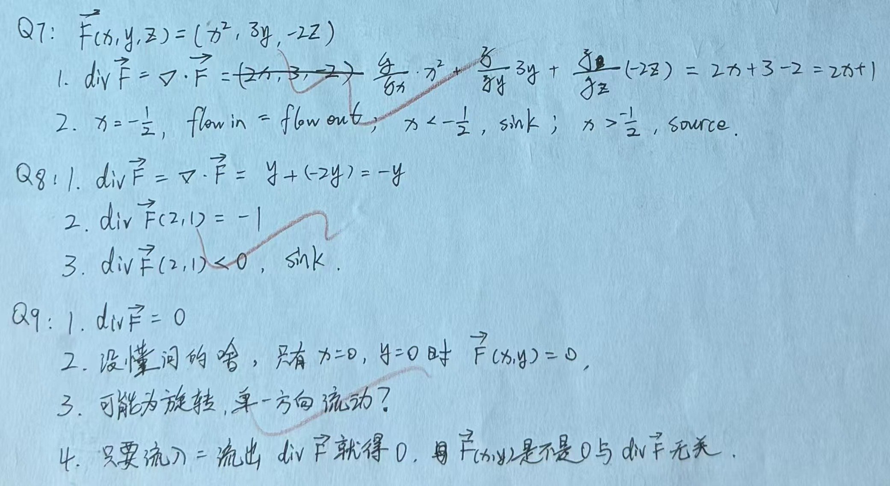

# Exercise 17 - Divergence Practice

- Week 2, Day 1 | Type: practice (closed-book, handwritten) | Date: 2026-08-07
- Companion notes: [day01-vector-calculus-foundations.md](../../notes/week02/day01-vector-calculus-foundations.md)
- Result: all divergence calculations and physical classifications correct

## Questions

**Q7.** Given $\vec{F}(x,y,z)=(x^2,3y,-2z)$, find $\nabla\cdot\vec{F}$ and classify the field locally as source, sink or zero net outflow.

**Q8.** Given $\vec{F}(x,y)=(xy,x-y^2)$, find the divergence, evaluate it at $(2,1)$ and classify the local behaviour.

**Q9.** Given $\vec{F}(x,y)=(-2y,2x)$, find the divergence, determine whether the vector field is zero, identify the likely flow pattern and explain why zero divergence does not imply a zero field.

## Key Results

- Q7: $\nabla\cdot\vec{F}=2x+1$. It is a source for $x>-1/2$, a sink for $x<-1/2$ and has zero local net outflow at $x=-1/2$.
- Q8: $\nabla\cdot\vec{F}=-y$, so $\nabla\cdot\vec{F}(2,1)=-1$ and the point is locally sink-like.
- Q9: $\nabla\cdot\vec{F}=0$, but the field is nonzero except at the origin and represents counter-clockwise rotational flow.

## Feedback Summary

- Q7: correct, including the position-dependent classification
- Q8: correct
- Q9: correct; zero divergence means no local net outflow, not zero motion or zero rotation

## Handwritten Answer

