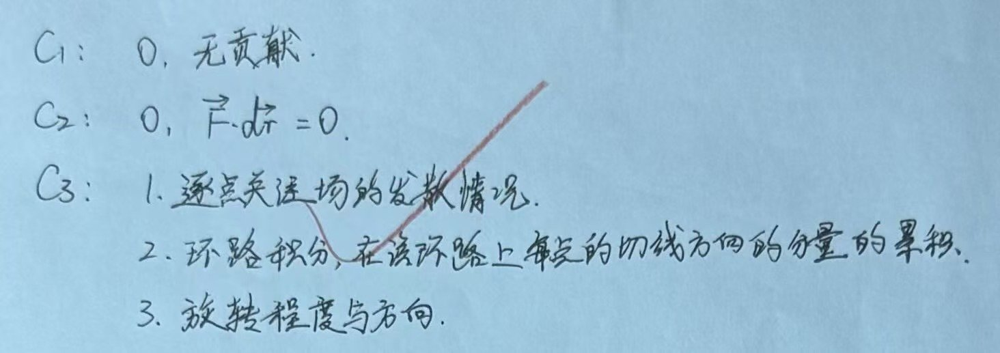

# Exercise 18 - Line Integral and Circulation Check

- Week 2, Day 1 | Type: concept check (closed-book, handwritten) | Date: 2026-08-07
- Companion notes: [day01-vector-calculus-foundations.md](../../notes/week02/day01-vector-calculus-foundations.md)
- Result: all three conceptual answers correct

## Questions

**C1.** If $\vec{F}$ is perpendicular to $d\vec{r}$, what is $\vec{F}\cdot d\vec{r}$ and does that segment contribute to the line integral?

**C2.** For a circular path, suppose the vector field points radially outward while the displacement is tangential. What is the circulation and why?

**C3.** State briefly what divergence, circulation and curl each measure.

## Key Results

- C1: $\vec{F}\cdot d\vec{r}=0$, so there is no contribution to the line integral.
- C2: the circulation is zero because the field and tangent direction are perpendicular at every point.
- C3: divergence measures local net outflow; circulation accumulates the tangential field around a closed path; curl measures local rotation tendency and its axis direction.

## Feedback Summary

- C1: correct
- C2: correct
- C3: correct; the distinction between local quantities and a path-integrated quantity was added

## Handwritten Answer

