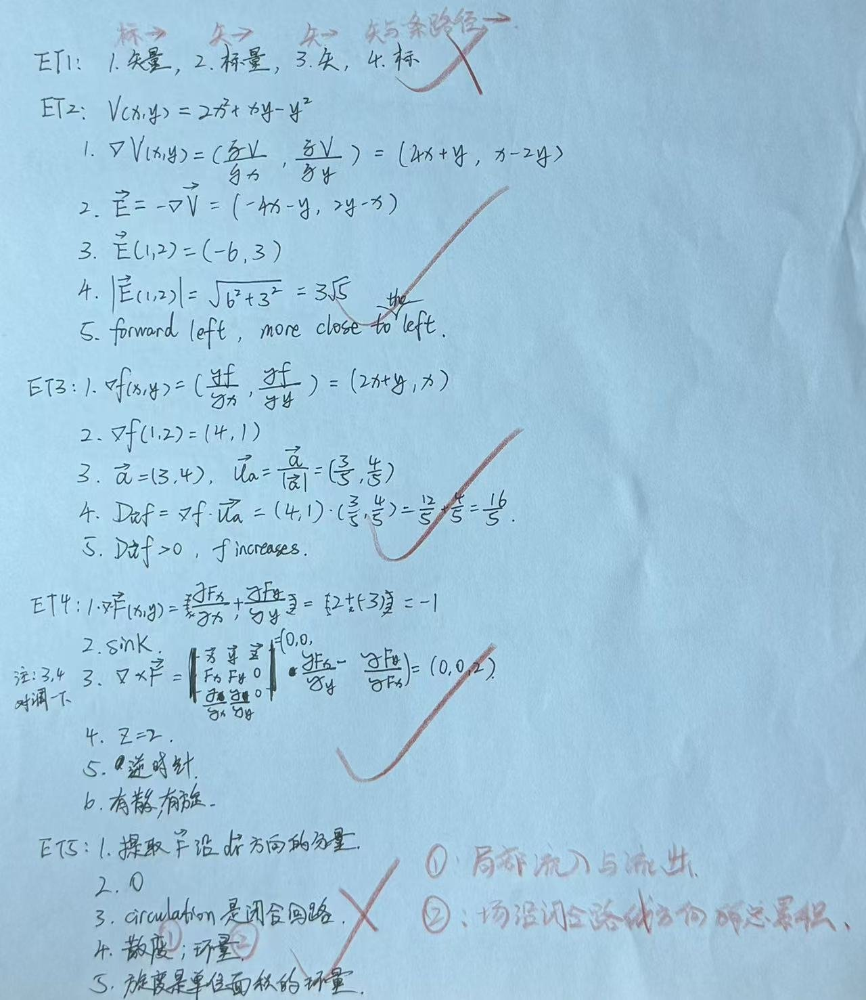

# Exercise 19 - Vector Calculus Exit Test

- Week 2, Day 1 | Type: exit test (closed-book, handwritten) | Date: 2026-08-07
- Companion notes: [day01-vector-calculus-foundations.md](../../notes/week02/day01-vector-calculus-foundations.md)
- Result: about 92% mastery; ET2-ET4 correct, ET1 incomplete, ET5 required precision

## Questions

**ET1.** State the input and output type of $\nabla u$, $\nabla\cdot\vec{F}$, $\nabla\times\vec{F}$ and $\int_C\vec{F}\cdot d\vec{r}$.

**ET2.** Given $V(x,y)=2x^2+xy-y^2$, find $\nabla V$, $\vec{E}=-\nabla V$, the field at $(1,2)$, its magnitude and its direction.

**ET3.** Given $f(x,y)=x^2+xy$, find the directional derivative at $(1,2)$ along $\vec{a}=(3,4)$ and state whether $f$ increases or decreases.

**ET4.** Given $\vec{F}(x,y)=(2x-y,x-3y)$, find divergence, curl and the local source/sink and rotation classifications.

**ET5.** Explain the role of the dot product in a vector line integral, the perpendicular-field case, the difference between an open-path line integral and circulation, the distinction between divergence and circulation, and the local relationship between curl and circulation.

## Key Results

- ET1: gradient maps scalar to vector; divergence maps vector to scalar; curl maps vector to vector; a vector line integral along a path produces a scalar.
- ET2: $\nabla V=(4x+y,x-2y)$, $\vec{E}=(-4x-y,2y-x)$, $\vec{E}(1,2)=(-6,3)$ and $|\vec{E}|=3\sqrt{5}$; direction is mainly negative $x$ and slightly positive $y$.
- ET3: $\nabla f=(2x+y,x)$, $\nabla f(1,2)=(4,1)$, $\vec{u}=(3/5,4/5)$ and $D_{\vec{u}}f=16/5>0$.
- ET4: $\nabla\cdot\vec{F}=-1$, so the field is locally sink-like. $\nabla\times\vec{F}=(0,0,2)$, so it has counter-clockwise rotation when viewed from positive $z$. The field is both divergent and rotational.
- ET5: the dot product selects the tangential component; a perpendicular field contributes zero; circulation is a closed-path line integral; divergence measures local net outflow; the normal component of curl is the limiting circulation per unit area around an infinitesimal loop.

## Feedback Summary

- ET1: output types correct, but input types omitted
- ET2: correct
- ET3: correct
- ET4: correct; working was crowded but the formula and conclusion were right
- ET5: first three ideas correct; the divergence/circulation distinction was too brief, and the curl-circulation statement needed the limiting-area and normal-component conditions

## Handwritten Answer

