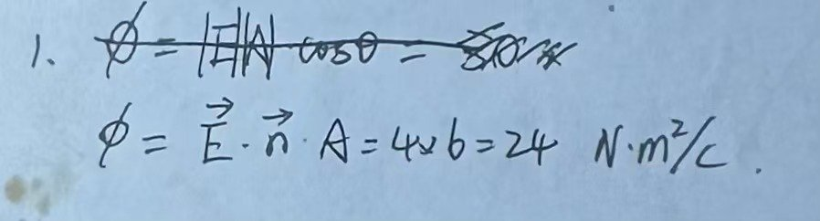

# Exercise 21 — Flux Guided Example

- **Week/Day | Type | Date:** Week 2 Day 2 | Guided example (worked with prompts) | 2026-08-08
- **Companion notes:** [day02-surface-integrals-flux.md](../../notes/week02/day02-surface-integrals-flux.md)
- **Result:** Correct (numerical answer and method right; small notation improvements noted).

## Questions

A rectangular plate has sides $a=3~\text{m}$ and $b=2~\text{m}$, with unit normal $\hat{n}=\hat{x}=(1,0,0)$. A uniform electric field $\vec{E}=(4,3,0)~\text{V/m}$ is present.

(a) Compute the area $A$ of the plate.

(b) Compute the component of $\vec{E}$ perpendicular to the plate (i.e. $\vec{E}\cdot\hat{n}$). Which component of $\vec{E}$ contributes, and which component slides parallel to the plate and contributes nothing?

(c) Compute the electric flux $\Phi$ through the plate.

Hints were given before the student answered: $A=ab=6~\text{m}^2$; $\vec{E}\cdot\hat{n}=E_x=4~\text{V/m}$; use $\Phi=(\vec{E}\cdot\hat{n})A$.

## Key Results

- (a) $A=ab=3\times 2=6~\text{m}^2$.
- (b) $\vec{E}\cdot\hat{n}=E_x=4~\text{V/m}$; $E_y=3~\text{V/m}$ is parallel to the plate and contributes zero.
- (c) $\Phi=(\vec{E}\cdot\hat{n})A=4\times 6=24~\text{V·m}$ (equivalently $24~\text{N·m}^2/\text{C}$).

## Feedback Summary

- The student first wrote $|\vec{E}||\vec{A}|\cos\theta$, recognised the simpler dot-product form, crossed out the first line, and wrote $\Phi=\vec{E}\cdot\vec{n}\cdot A=4\times 6=24~\text{N·m}^2/\text{C}$.
- The method shift from the angle form to the dot-product form is exactly the conceptual move the lesson was targeting — recognition that only the normal component contributes.
- Numerical answer 24 and unit N·m²/C are correct (V·m is the same unit, just written using $1~\text{V/m}=1~\text{N/C}$).
- Notation improvements for future work:
  - write flux as uppercase $\Phi$, not lowercase $\phi$;
  - write the unit normal as $\hat{n}$ (hat, to emphasise unit length) rather than $\vec{n}$;
  - write the formula as $\Phi=(\vec{E}\cdot\hat{n})A$ or most cleanly $\Phi=\vec{E}\cdot\vec{A}$ with $\vec{A}=\hat{n}A$, to avoid the ambiguous "$\cdot$" between a scalar and a scalar.

## Handwritten Answer

