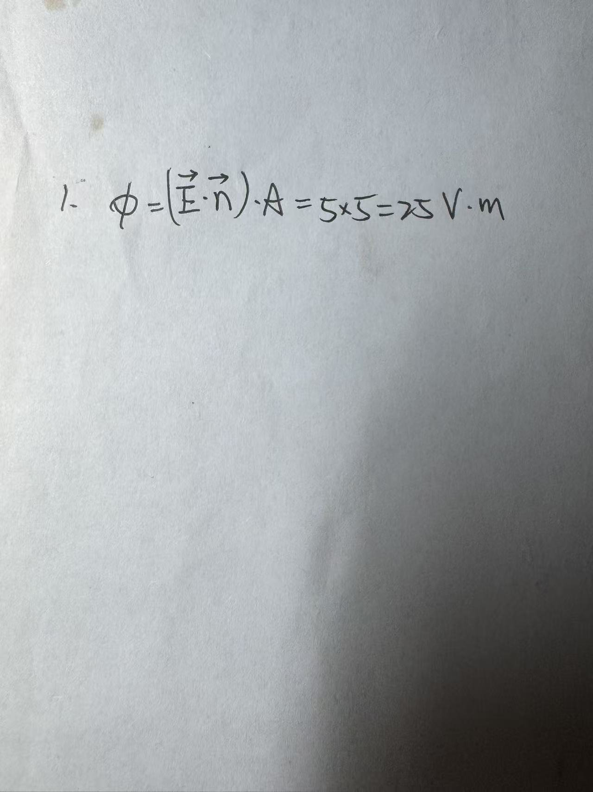

# Exercise 22 — Flux Independent Practice

- **Week/Day | Type | Date:** Week 2 Day 2 | Independent practice | 2026-08-08
- **Companion notes:** [day02-surface-integrals-flux.md](../../notes/week02/day02-surface-integrals-flux.md)
- **Result:** Correct (numerical answer and method right; minor notation improvements noted).

## Questions

A rectangular plate of area $A=5~\text{m}^2$ sits in a uniform electric field $\vec{E}=(0,10,0)~\text{V/m}$. The unit normal to the plate is $\hat{n}=(0,\cos60°,\sin60°)=(0,0.5,\sqrt{3}/2)$ (i.e. the normal lies in the $yz$-plane at $60°$ to the $y$-axis).

(a) Compute the electric flux $\Phi$ through the plate, using $\Phi=(\vec{E}\cdot\hat{n})A$.

(b) As a cross-check, compute the same flux using $\Phi=EA\cos\theta$ and confirm the two methods agree.

(c) State in one sentence why the $z$-component of $\hat{n}$ does or does not contribute.

(The problem was posed as one numerical computation with a component-interpretation prompt; the student answered the numerical part, so part (c) was addressed verbally in feedback.)

## Key Results

- (a) $\vec{E}\cdot\hat{n}=(0,10,0)\cdot(0,0.5,\sqrt{3}/2)=5~\text{V/m}$, so $\Phi=5\times 5=25~\text{V·m}$.
- (b) $\theta=60°$, $\cos60°=0.5$, $EA\cos\theta=10\times 5\times 0.5=25~\text{V·m}$, agreeing with (a).
- (c) The $z$-component of $\hat{n}$ pairs with $E_z=0$, so it contributes nothing. Physically, the electric field has no component along $z$, so tilting the normal in the $z$ direction cannot change how much field crosses the plate.

## Feedback Summary

- Student answer: $\Phi=(\vec{E}\cdot\vec{n})\cdot A=5\times 5=25~\text{V·m}$.
- Numerical answer and unit are correct. The dot-product step $10\times 0.5=5$ was done mentally, which is appropriate at this stage.
- The answer demonstrates clean use of "only the normal component along the field contributes": the $z$-component of $\hat{n}$ is automatically ignored by the dot product because $E_z=0$.
- Notation reminders (continued): write $\Phi$ (uppercase) for flux and $\hat{n}$ (hat) for the unit normal; the clean form is $\Phi=(\vec{E}\cdot\hat{n})A$.

## Handwritten Answer

