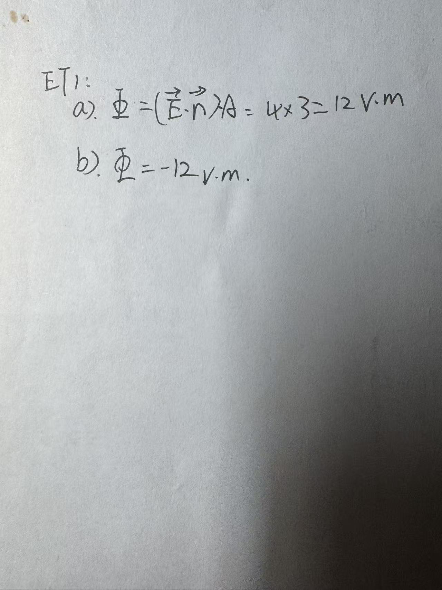

# Exercise 23 — Flux Exit Test

- **Week/Day | Type | Date:** Week 2 Day 2 | Exit test | 2026-08-08
- **Companion notes:** [day02-surface-integrals-flux.md](../../notes/week02/day02-surface-integrals-flux.md)
- **Result:** (a) Correct; (b) Basically correct (numerical value correct, one-sentence physical interpretation initially omitted).

## Questions

A uniform electric field $\vec{E}=8~\text{V/m}$ points along the $x$-axis, i.e. $\vec{E}=(8,0,0)~\text{V/m}$, through a flat plate of area $A=3~\text{m}^2$. The unit normal to the plate is $\hat{n}=(\cos60°,\sin60°,0)=(0.5,\sqrt{3}/2,0)$, so $\hat{n}$ lies in the $xy$-plane at $60°$ to the $x$-axis.

**(a)** Compute the electric flux $\Phi$ through the plate.

**(b)** If the normal is flipped to $-\hat{n}$ (i.e. we count from the other face), what is the new flux $\Phi'$? Answer with both the numerical value and one sentence describing what the sign change means physically.

## Key Results

- (a) $\vec{E}\cdot\hat{n}=8\times 0.5=4~\text{V/m}$; $\Phi=(\vec{E}\cdot\hat{n})A=4\times 3=12~\text{V·m}$.
- (b) With $-\hat{n}$, $\Phi'=(\vec{E}\cdot(-\hat{n}))A=-12~\text{V·m}$. Physical meaning: the field and the physical plate are unchanged; only the "which side is the front" convention is flipped. The $+12$ field lines that previously exited the chosen front face are now counted as $-12$ field lines entering the newly chosen front face. For closed surfaces the outward-normal convention removes this sign ambiguity.

## Feedback Summary

- (a) Student answer: $(\vec{E}\cdot\vec{n})A=4\times 3=12~\text{V·m}$. Correct. The intermediate value 4 shows the student computed $8\cos60°=4$ fluently.
- (b) Student answer: $\Phi=-12~\text{V·m}$. Numerical value correct. The one-sentence physical interpretation was not written and was supplied in marking feedback (see Key Results (b)). In future answers, when a problem asks for physical meaning, give the sentence even though the number is obvious.
- Notation reminders (final): use uppercase $\Phi$ for flux and $\hat{n}$ for the unit normal. These are low-priority habit corrections, not conceptual errors.
- Overall: the projection rule, sign convention, and open-surface normal ambiguity are all securely understood. The 90% day-mastery estimate reflects the missing sentence rather than any conceptual gap.

## Handwritten Answer

